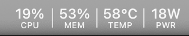
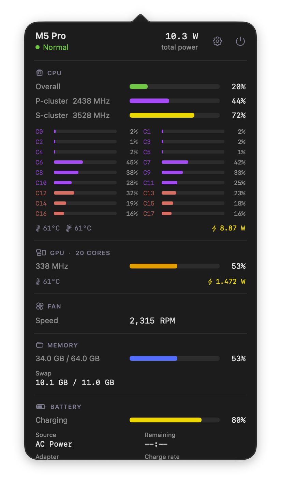

<div align="center">


# MMetrics

Apple Silicon system monitor for the menu bar — CPU, GPU, memory, power, temperatures,
fan, battery, network and disk, read from native macOS interfaces (SMC, IOReport, Mach).

[](https://www.apple.com/macos/)
[](https://www.apple.com/mac/)
[](LICENSE)





</div>

## Features

- **Menu bar** — two-row cells (value over caption). Choose any of CPU, memory, GPU,
  CPU temperature, system power, download and upload in Settings.
- **Dashboard** — click the menu bar item. Each section can be hidden in Settings;
  hidden Top Processes, Network, Disk I/O and Battery also stop sampling.

  | Section | Content |
  |---------|---------|
  | CPU | Overall · per-cluster (E / P / S, only those the chip has) · per-core · temperature · die hotspot · power |
  | GPU | Usage · frequency · temperature · power |
  | Fan | RPM (hidden on fanless Macs) |
  | Memory | Used / total · swap · DRAM bandwidth (when the chip exposes it) |
  | Battery | Charge · status · adapter / charge watts · cycles · health · capacity · temperature |
  | Network / Disk I/O | Download / upload · read / write throughput |
  | Power rails | CPU · GPU · ANE / DRAM (when available) · system · total |
  | Top Processes | Top CPU consumers with memory |

- **Desktop widget** — small and medium sizes with CPU, memory and thermal state.
- **Appearance** — Automatic, Light or Dark.

## Install

```bash
brew tap lollipopkit/mmetrics https://github.com/lollipopkit/mac-power-metric
brew install --cask mmetrics
```

Or download the DMG from [Releases](../../releases/latest) and drag MMetrics to
Applications. Releases are signed with Developer ID and notarised.

## Data sources

| Source | Data |
|--------|------|
| Mach (`host_processor_info`, `vm_statistics64`) | CPU usage, memory, swap |
| IOReport | Cluster / GPU residency and frequency, energy counters, DRAM bandwidth |
| SMC | Temperatures, die hotspot, fan, system power; CPU power where IOReport has no CPU energy (M5 Pro) |
| `pmset` / `ioreg` / `netstat` | Battery, disk I/O, network |

The optional helper (`/Users/Shared/MMetrics/mmetrics-helper`, installed by the cask)
samples IOReport and SMC as root. The app works without it.

## Build

Xcode 15+, macOS 13+, Apple Silicon.

```bash
git clone https://github.com/lollipopkit/mac-power-metric.git
cd mac-power-metric
open MMetrics.xcodeproj          # set your Team for MMetrics and MMetricsWidget
./scripts/build-dmg.sh           # ad-hoc signed DMG in dist/, helper embedded
```

**Release** (maintainers): `./scripts/release.sh <version>` bumps the version, builds a
Developer ID–signed DMG, notarises and staples it, updates the cask, tags, pushes and
publishes the GitHub Release. One-time setup: a Developer ID Application certificate in
the keychain and `xcrun notarytool store-credentials mmetrics-notary`.

## Tested hardware

| Mac | Chip |
|-----|------|
| MacBook Air (2022) | M2 |
| — | M5 Pro |

Reports from other chips are welcome.

## Acknowledgements

- Based on [MacMonitor](https://github.com/ryyansafar/MacMonitor) by [Ryyan Safar](https://github.com/ryyansafar).
- [mactop](https://github.com/metaspartan/mactop) — cross-validation reference during sensor research.

## License

[MIT](LICENSE)
